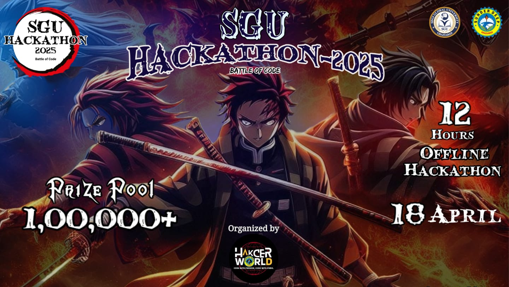
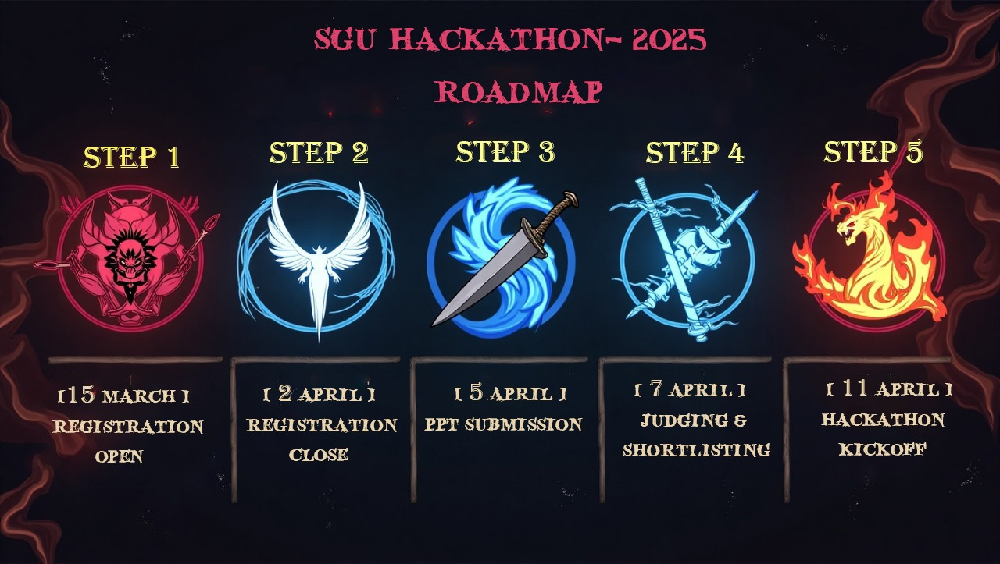

# SGU Hackathon 2025 Event Webpage

[](index.html)
[](styles.css)
[](script.js)
[](#)

A Demon Slayer-inspired, single-page hackathon website built for **SGU Hackathon 2025**, managed by **Hacker World SDEC**.

The website includes animated visuals, event timeline, themes, prizes, mentors, FAQ, sponsor slider, and registration CTA.

## Preview





## Demo Video

[Watch Demo (MP4)](images/videovideo.mp4)

<video src="images/videovideo.mp4" controls width="900"></video>

## Key Features

- Responsive single-page design
- Animated loading screen
- Particle.js interactive background
- Hero section with sponsor and registration CTA
- Prize cards with total pool highlight
- Timeline/roadmap section
- Live countdown timer logic
- Theme cards with looping videos
- Mentor showcase section
- FAQ accordion with pagination
- Auto-play sponsor carousel
- Footer with social and community links

## Tech Stack

- HTML5
- CSS3
- JavaScript (Vanilla JS)
- jQuery (CDN)
- Slick Carousel (CDN)
- Bootstrap 3 (CDN)
- Particles.js (CDN)

## Project Structure

```text
HackathonWebpageFinal-main/
|- index.html
|- styles.css
|- script.js
|- images/
   |- banner.jpg
   |- roadmapnew.jpg
   |- 1.png
   |- videovideo.mp4
   |- ...other media assets
```

## Run Locally

1. Clone this repository.
2. Open the project folder.
3. Launch the site:
- Open `index.html` directly in your browser, or
- Use VS Code Live Server and open `index.html`

## Deploy on GitHub Pages

1. Push this project to a GitHub repository.
2. Open repository `Settings` -> `Pages`.
3. Under `Build and deployment`, select `Deploy from a branch`.
4. Choose branch `main` and folder `/ (root)`.
5. Save and wait for GitHub Pages deployment.
6. Your site will be available at:

```text
https://<your-username>.github.io/<your-repo-name>/
```

## Open Source Notes

- No `LICENSE` file is included yet.
- Add a license (for example MIT) if you want others to reuse this project.
- Keep media attribution where required for external images/videos.

## Contributing

1. Fork the repository.
2. Create a new feature branch.
3. Commit your changes with clear messages.
4. Open a pull request with a short description and screenshots (if UI changed).

## Issues

If you find a bug or want improvements, open a GitHub Issue with:

- Expected behavior
- Actual behavior
- Steps to reproduce
- Browser and device details

## Important Notes

- CDN resources are required for full functionality (Bootstrap, jQuery, Slick, Particles.js).
- The countdown date in `script.js` is currently set to **April 5, 2025** and should be updated for future events.

## Credits

- Organized by **Hacker World SDEC**
- Event assets and logos belong to their respective owners
